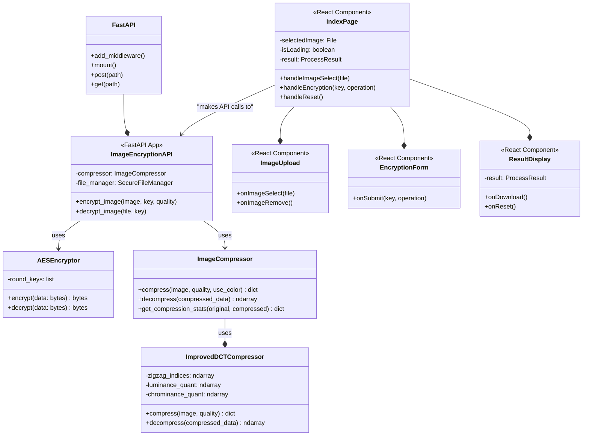
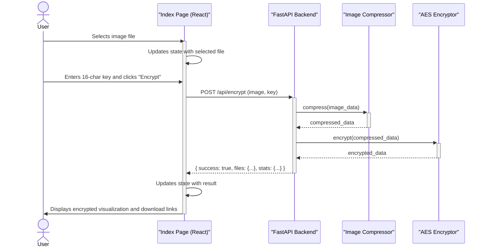

# Project Diagrams

This document contains the class and sequence diagrams for the Image Encryption project, rendered using Mermaid.

## Class Diagram

This diagram shows the static structure of the system, including classes and their relationships.

## Sequence Diagram

This diagram illustrates the dynamic interaction between objects for the encryption process.

